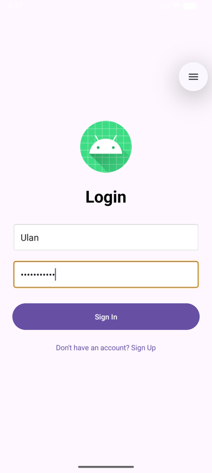
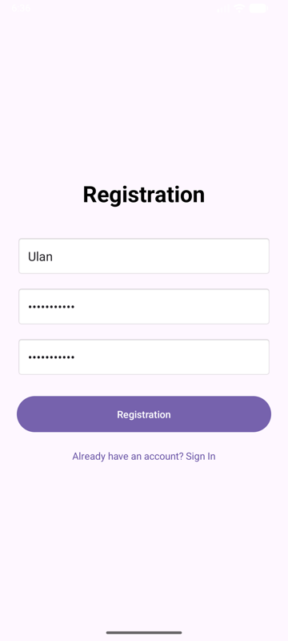
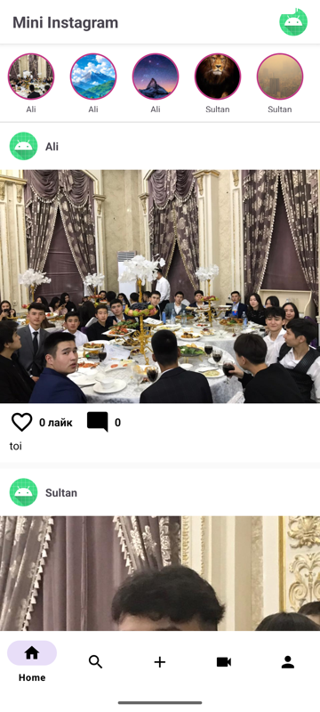
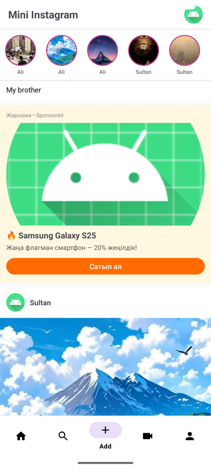

# Mini Instagram

Instagram клоны — Django REST + Android (Kotlin)

## Жоба құрылымы
mini-instagram/
├── backend/ # Django REST API
├── android/ # Kotlin Android қосымшасы
└── screenshots/ # Скриншоттар

## Функциялар

- ✅ Тіркелу / Кіру (JWT)
- ✅ Посттар лентасы + Сторис
- ✅ Лайк + Комментарийлер
- ✅ Direct Messages (WebSocket)
- ✅ Пост қосу (галереядан)
- ✅ Профиль беті
- ✅ Іздеу
- ✅ Жарнама блогы
- ✅ Pull-to-refresh

## Технологиялар

| Backend | Android |
|---------|---------|
| Python 3.11 | Kotlin |
| Django 6.0 | Retrofit2 |
| Django REST Framework | OkHttp (WebSocket) |
| Django Channels | Glide |
| PostgreSQL / SQLite | RecyclerView |
| Redis / InMemory | JWT Auth |
| JWT (SimpleJWT) | Material Design |

## Скриншоттар

| Login | Registration | Home |
|-------|-------------|------|
|  |  |  |

| Stories | Жарнама | Add Post |
|---------|---------|----------|
|  |  |  |

| Comments | Profile | Direct |
|----------|---------|--------|
|  |  |  |

## Автор

**whvtnk** — 3-курс CS студенті, Қазақстан  
GitHub: [whvtnk](https://github.com/whvtnk)
