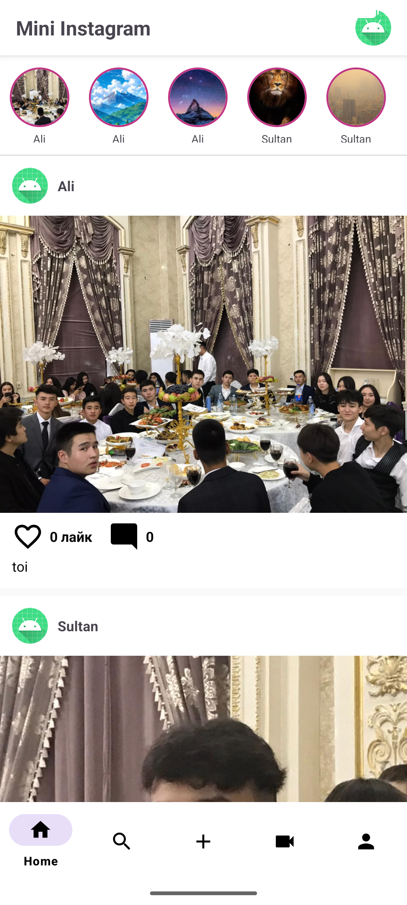
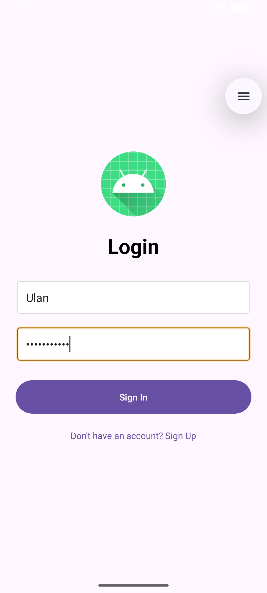
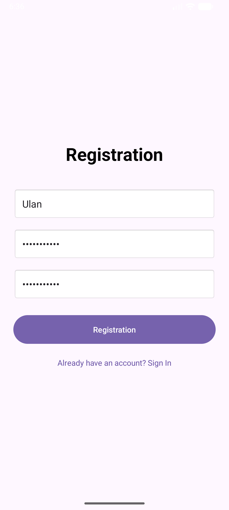
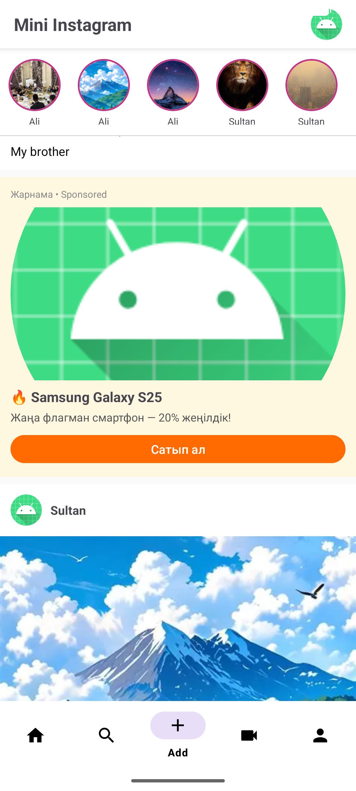
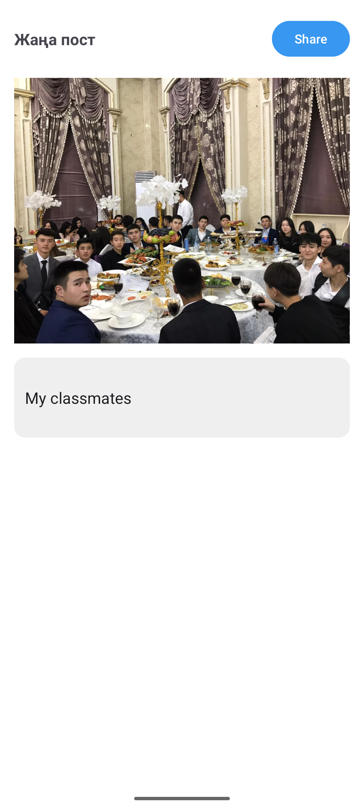
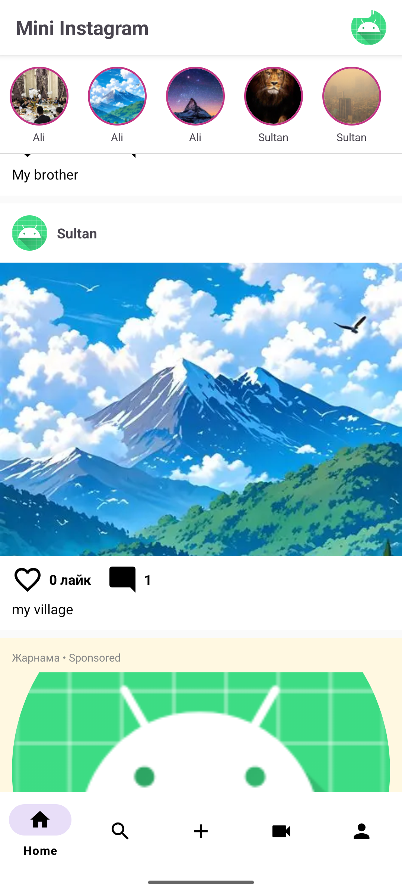
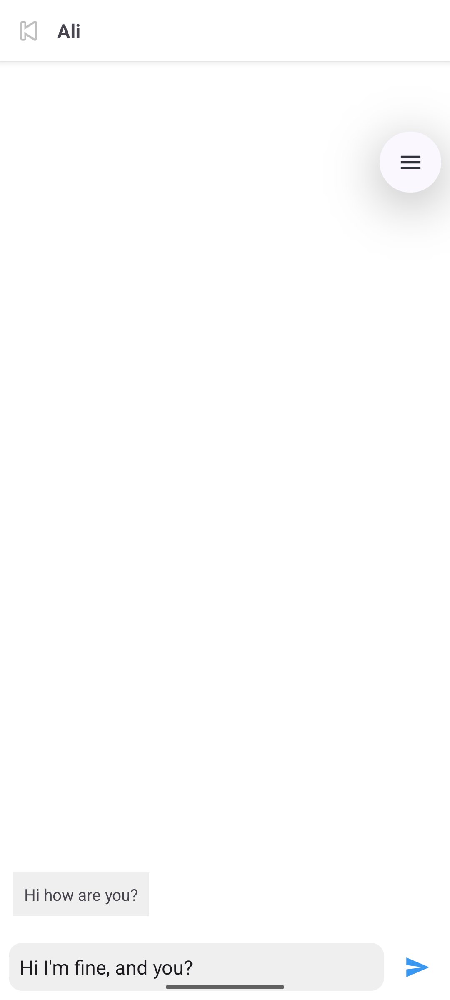

# Mini Instagram

Instagram-тың Android + Django нұсқасы.



## Технологиялар

**Backend:**
- Python / Django REST Framework
- PostgreSQL
- JWT аутентификация
- Django Channels (WebSocket)
- Redis

**Android:**
- Kotlin
- Retrofit2 + OkHttp
- Glide
- RecyclerView
- WebSocket (Direct Messages)

## Функциялар

- ✅ Тіркелу / Кіру (JWT)
- ✅ Посттар лентасы
- ✅ Сторис
- ✅ Лайк жүйесі (анимациямен)
- ✅ Комментарийлер
- ✅ Пост қосу (галереядан)
- ✅ Профиль беті
- ✅ Іздеу
- ✅ Direct Messages (WebSocket)
- ✅ Bottom Navigation
- ✅ Pull-to-refresh
- ✅ Жарнама блогы

## 📱 Скриншоттар

| Login | Registration | Home |
|-------|-------------|------|
|  |  |  |

| Stories | Жарнама | Add Post |
|---------|---------|----------|
|  |  |  |

| Comments | Profile | Direct |
|----------|---------|--------|
|  |  |  |

## Іске қосу

### Backend:
```bash
cd insta_project
python -m venv venv
venv\Scripts\activate
pip install -r requirements.txt
python manage.py migrate
python manage.py runserver 0.0.0.0:8000
```

### Android:

## 👤 Автор

**whvtnk** — 3-курс CS студенті, Қазақстан